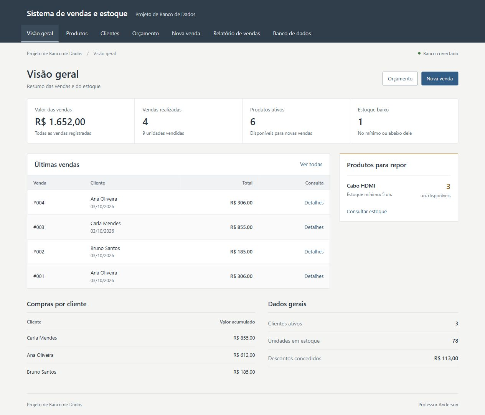
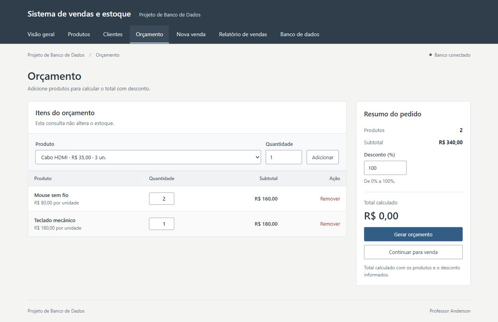

# Sistema de vendas e estoque

Aplicação desenvolvida para o trabalho individual de **Projeto de Banco de Dados**. O objetivo é demonstrar modelagem de dados, operações CRUD e integração com View, Function e Procedure reais do PostgreSQL, usando vendas e estoque como exemplo prático.



## Identificação

- **Autor:** Emanuel Cândido da Silva Lima
- **Disciplina:** Projeto de Banco de Dados
- **Professor:** Anderson
- **Entrega prevista no enunciado:** 07/10/2026
- **Repositório:** [EmanuelCandido/Estoque-de-vendas](https://github.com/EmanuelCandido/Estoque-de-vendas).
- **Vídeo explicativo:** [assistir à apresentação no YouTube](https://youtu.be/KqyOtL93yEo).

## Vídeo de apresentação

[Assistir ao vídeo de apresentação no YouTube](https://youtu.be/KqyOtL93yEo)

[Baixar a cópia em MP4](https://github.com/EmanuelCandido/Estoque-de-vendas/raw/refs/heads/main/docs/videos/apresentacao.mp4)

Duração: **4 minutos e 1 segundo**. O arquivo também está disponível em `docs/videos/apresentacao.mp4` ao clonar o projeto.

O enunciado pede a apresentação do objetivo, do problema e das funcionalidades; a demonstração das telas; a explicação dos códigos da View, Function e Procedure, com seus parâmetros, resultados e usos; e a demonstração do fluxo da tela até o banco e de volta à aplicação.

## Problema e funcionalidades

Uma pequena loja precisa manter clientes, produtos e estoque organizados, calcular descontos corretamente e registrar uma venda sem deixar os dados inconsistentes.

Funcionalidades disponíveis:

- Visão geral com faturamento, vendas, clientes e alertas de estoque baixo.
- CRUD de produtos: cadastro, consulta, edição e exclusão, com preço e estoque mínimo.
- CRUD de clientes: cadastro, consulta, edição e exclusão.
- Inativação de clientes e produtos sem apagar o histórico de vendas.
- Orçamento com cálculo do total e desconto entre 0% e 100%, com até duas casas decimais.
- Registro de venda com vários itens e baixa automática no estoque.
- Relatório de vendas com filtros de data e detalhamento dos itens.
- Tela **Banco de dados**, com o código SQL e registros das chamadas reais à View, Function e Procedure, útil para a apresentação.

## Tecnologias

- Python 3.10 ou superior; projeto validado com Python 3.12.
- Flask para a API e a página web.
- Psycopg 3 para conexão e consultas parametrizadas.
- PostgreSQL 17, com SQL e PL/pgSQL.
- Waitress para servir a aplicação local.
- HTML, CSS e JavaScript sem dependências de interface externas.
- unittest para testes de integração em PostgreSQL real.

## Banco de dados

| Tabela | Finalidade |
| --- | --- |
| `clientes` | Dados de contato e situação dos clientes. |
| `produtos` | Catálogo, preços, estoque atual e estoque mínimo. |
| `vendas` | Cliente, data, percentual de desconto e total confirmado. |
| `itens_venda` | Produtos, quantidades e preços praticados em cada venda. |

Uma venda pertence a um cliente e possui vários itens. Cada item se relaciona com um produto. Os nomes e preços utilizados na venda são preservados para que alterações posteriores nos cadastros não reescrevam o histórico.

| Recurso obrigatório | Nome | Finalidade | Integração real |
| --- | --- | --- | --- |
| View | `vw_relatorio_vendas` | Consolidar dados de vendas, clientes e itens. | Relatório: `GET /api/relatorio` executa `SELECT ... FROM vw_relatorio_vendas`. |
| Function | `fn_calcular_total_venda(p_subtotal NUMERIC, p_desconto NUMERIC)` | Aplicar o desconto ao subtotal e retornar o valor final. | Orçamento: `POST /api/orcamento` executa `SELECT fn_calcular_total_venda(...)`. |
| Procedure | `sp_baixar_estoque(p_produto_id INTEGER, p_quantidade INTEGER)` | Reduzir o estoque de um produto vendido. | Nova venda: `POST /api/vendas` executa `CALL sp_baixar_estoque(...)` para cada produto. |

No orçamento, o Python consulta os preços cadastrados, soma preço vezes quantidade e envia o subtotal e o desconto para a Function. Ao confirmar a venda, o Python registra a venda e seus itens, chama a Procedure para baixar o estoque de cada produto e usa a Function para calcular o total. Tudo ocorre na mesma transação: se qualquer etapa falhar, a conexão desfaz as operações.

A Procedure usa apenas um `UPDATE` e um `IF`: reduz o estoque quando o produto está ativo, a quantidade é válida e há unidades suficientes; caso contrário, gera um erro. Por exemplo, `CALL sp_baixar_estoque(1, 2)` dá baixa em duas unidades do produto 1. A condição no próprio `UPDATE` também impede vender a mesma última unidade duas vezes. O Python processa os produtos em ordem de código.

Com 100% de desconto, o total é R$ 0,00. A venda e seus itens são registrados, o estoque é atualizado e o relatório mostra o valor integral como desconto concedido. Valores negativos ou acima de 100% são rejeitados.



## Execução rápida no Windows

1. Instale Python 3.10 ou superior, com o comando `python` ou o iniciador `py` disponível no terminal.
2. Dê dois cliques em **`iniciar.bat`** na pasta do projeto.
3. Na primeira execução, aguarde a instalação das dependências e o download do PostgreSQL portátil oficial, de aproximadamente 325 MB. É necessária internet nessa primeira preparação.
4. Abra **[http://127.0.0.1:5000](http://127.0.0.1:5000)**.

O iniciador cria o ambiente virtual, inicia um PostgreSQL real em `127.0.0.1:55432`, cria o banco `estoque_facil`, aplica os scripts e insere exemplos apenas se o banco estiver vazio. Reiniciar preserva os dados já cadastrados.

Para obter o projeto pelo terminal:

```powershell
git clone https://github.com/EmanuelCandido/Estoque-de-vendas.git
cd Estoque-de-vendas
.\iniciar.bat
```

O script `tables/02_limite_desconto.sql` atualiza as restrições dos bancos que ainda usam o limite anterior. A atualização acontece ao iniciar pelo PostgreSQL portátil ou ao executar `scripts/setup_db.py` no banco configurado.

O script `migrations/01_simplificar_rotinas.sql` remove as assinaturas anteriores da Function e da Procedure antes de criar as versões simplificadas. As tabelas e seus registros são preservados.

Alternativa pelo PowerShell:

```powershell
powershell -NoProfile -ExecutionPolicy Bypass -File .\iniciar.ps1
```

Para encerrar a aplicação, pressione `Ctrl+C` no terminal. Para encerrar também o PostgreSQL portátil:

```powershell
powershell -NoProfile -ExecutionPolicy Bypass -File .\parar-banco.ps1
```

Os arquivos `.venv/`, `.runtime/` e `.local/` são locais e ignorados pelo Git. A senha do banco portátil é gerada automaticamente e permanece em `.local/`; ela não pertence ao repositório. O iniciador portátil exige Windows de 64 bits.

## PostgreSQL instalado ou Docker

Crie um banco vazio chamado `estoque_facil` no PostgreSQL instalado, ou execute:

```bash
docker compose up -d --wait db
```

Prepare o Python e configure a conexão:

```powershell
py -3 -m venv .venv
.\.venv\Scripts\python.exe -m pip install -r requirements.txt
Copy-Item .env.example .env
# Edite DATABASE_URL no arquivo .env, se necessário.
.\.venv\Scripts\python.exe scripts\setup_db.py
.\.venv\Scripts\python.exe -m src.app
```

No Linux/macOS, use `python3 -m venv .venv`, `.venv/bin/python` nos comandos e `cp .env.example .env`. A configuração do exemplo atende ao PostgreSQL do Docker, na porta 5432. O iniciador portátil usa sua própria conexão na porta 55432.

Para instalar diretamente com o cliente `psql` em um banco novo:

```bash
psql -h 127.0.0.1 -U postgres -d estoque_facil -f database/install.sql
```

`install.sql` aplica tabelas, Function, Procedure, View e exemplos dentro de uma transação. Para reaplicar os objetos sem duplicar dados de exemplo, use `scripts/setup_db.py`.

## Exemplo para testar e gravar

1. Em **Orçamento**, adicione 2 unidades de **Mouse sem fio**, a R$ 80 cada.
2. Adicione 1 unidade de **Teclado mecânico**, a R$ 180.
3. Informe **10%** de desconto e clique em **Gerar orçamento**.
4. O subtotal será **R$ 340,00** e o total retornado pela Function será **R$ 306,00**.
5. Clique em **Continuar para venda**, escolha **Ana Oliveira** e confirme.
6. Confira a nova venda no **Relatório de vendas** e a redução de 2 mouses e 1 teclado em **Produtos**.
7. Abra **Banco de dados** para mostrar os scripts e os parâmetros/resultados das chamadas reais.

Os dados iniciais incluem 3 clientes, 6 produtos e 3 vendas, totalizando R$ 1.346,00. A imagem mostra o banco após uma venda adicional realizada na validação. Os valores e estoques aumentam ou diminuem conforme as ações realizadas. A tela de orçamento não altera estoque.

## Testes

Com o banco iniciado:

```powershell
.\.venv\Scripts\python.exe -m unittest discover -s tests -v
```

Os testes usam `TEST_DATABASE_URL`, `DATABASE_URL` ou a conexão do banco portátil, nessa ordem. Criam um schema temporário próprio e o removem ao terminar, preservando as tabelas da aplicação. O usuário de teste precisa ter permissão para criar schemas.

São verificados cálculo da Function, descontos de 0% a 100%, venda com total zero, agregação da View, baixa de estoque pela Procedure, gravação da venda, rollback por falta de estoque, CRUD, validações diretamente no banco, atualização das restrições sem perda de dados, preservação de histórico, filtros e duas vendas concorrentes da última unidade. O workflow em `.github/workflows/testes.yml` executa os mesmos testes com PostgreSQL 17 no GitHub Actions após a publicação.

## Organização

```text
src/
  app.py                   API e chamadas SQL reais
  db.py                    conexão e transações
  config.py                variáveis de ambiente
  templates/index.html     estrutura das telas
  static/                  estilos e comportamento da interface
database/
  tables/                  criação das tabelas
  migrations/              atualização das assinaturas antigas
  views/                   vw_relatorio_vendas
  functions/               fn_calcular_total_venda
  procedures/              sp_baixar_estoque
  inserts/                 dados de exemplo
  install.sql              instalação via psql
  demonstracao.sql          consultas para apresentação
scripts/                   inicialização do banco e PostgreSQL portátil
tests/                     testes de integração
docs/                      modelo, requisitos, execução e vídeo de apresentação
```

## Documentação e entrega

- [Modelo e fluxo de integração](docs/modelo-banco.md).
- [Referências de interface, técnicas aplicadas e ferramentas úteis](docs/referencias-interface.md).
- [Mapa de atendimento aos requisitos e checklist de entrega](docs/requisitos.md).
- [Atualização do repositório e entrega](docs/publicar-github.md).

O projeto foi preparado para demonstração acadêmica local. Os registros da tela Banco de dados ficam na memória da aplicação e são reiniciados quando o servidor é encerrado.

## Referências técnicas

- [PostgreSQL — CREATE VIEW](https://www.postgresql.org/docs/17/sql-createview.html)
- [PostgreSQL — CREATE FUNCTION](https://www.postgresql.org/docs/17/sql-createfunction.html)
- [PostgreSQL — CREATE PROCEDURE](https://www.postgresql.org/docs/17/sql-createprocedure.html)
- [PostgreSQL — CALL](https://www.postgresql.org/docs/17/sql-call.html)
- [PostgreSQL — binários oficiais para Windows](https://www.postgresql.org/download/windows/)
- [Flask — instalação](https://flask.palletsprojects.com/en/stable/installation/)
- [Psycopg — utilização básica](https://www.psycopg.org/psycopg3/docs/basic/usage.html)
