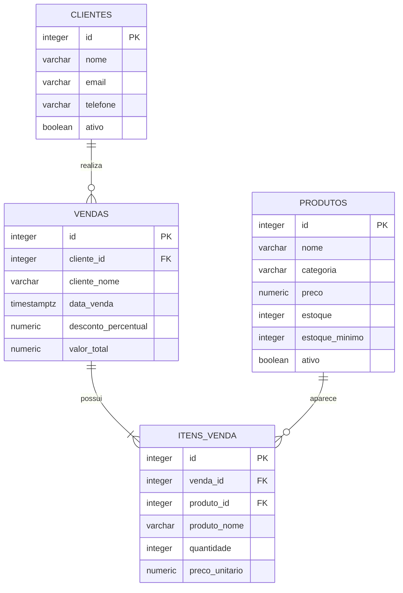
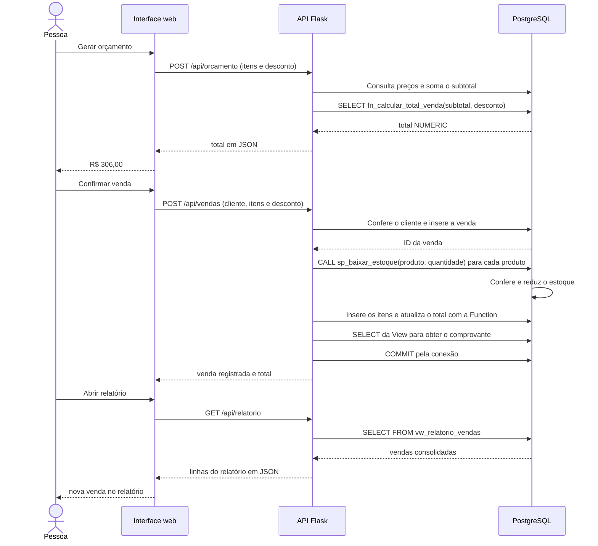

# Modelo do banco e integração

## Relacionamentos



As chaves estrangeiras garantem que cada venda referencie um cliente existente e cada item referencie uma venda e um produto. A restrição `UNIQUE(venda_id, produto_id)` impede o mesmo produto de aparecer em linhas duplicadas na mesma venda.

`cliente_nome`, `produto_nome` e `preco_unitario` guardam o que foi utilizado no momento da compra. Cadastros com vendas vinculadas podem ser inativados, mas sua exclusão é bloqueada pelas chaves estrangeiras.

## View: leitura consolidada

`vw_relatorio_vendas` reúne `vendas`, `clientes` e `itens_venda` com `JOIN`. Usa `COUNT`, `SUM` e `GROUP BY` para devolver uma linha por venda, com identificação, cliente, data, produtos diferentes, unidades, subtotal, desconto e valor final.

O relatório filtra a data no fuso `America/Sao_Paulo`. A View não define a ordenação; a consulta da aplicação aplica `ORDER BY` para exibir as vendas mais recentes primeiro.

## Function: cálculo reutilizável

`fn_calcular_total_venda(p_subtotal NUMERIC, p_desconto NUMERIC)` recebe o subtotal e o percentual de desconto e calcula:

```text
subtotal = soma(preço × quantidade)
total = arredondar(subtotal − subtotal × desconto / 100, 2)
```

Valida o subtotal positivo e o desconto de 0% a 100%, com até duas casas decimais. Retorna `NUMERIC`, sem inserir vendas ou modificar estoque. Um desconto de 100% resulta em total zero e pode ser utilizado no registro da venda. Tanto no orçamento quanto na venda, o Python soma preço vezes quantidade usando os valores do banco e envia esse subtotal à Function.

## Procedure: baixa de estoque

`sp_baixar_estoque` recebe apenas o código de um produto e a quantidade vendida. Por exemplo, `CALL sp_baixar_estoque(1, 2)` reduz em duas unidades o estoque do produto 1.

1. O `UPDATE` subtrai a quantidade do estoque na tabela `produtos`.
2. O `WHERE` exige o produto ativo, quantidade de 1 a 1000 e estoque suficiente.
3. O `IF NOT FOUND` gera um erro quando nenhuma linha foi atualizada.

O Python registra a venda, chama a Procedure para cada produto, grava os itens e calcula o total com a Function. A conexão Psycopg confirma tudo na mesma transação. Se qualquer etapa falhar, desfaz inclusive as baixas de estoque já realizadas. O `UPDATE` bloqueia o produto durante a transação e confere o estoque disponível, impedindo vender a mesma última unidade duas vezes.

## Fluxo real



Os registros da tela Banco de dados são produzidos depois das consultas executadas em `src/app.py`. Mostram a consulta parametrizada, os dados enviados e o resultado real. Para o vídeo, apresente também os trechos Python `quote`, `sell` e `report`, mostrando onde as consultas são executadas.
