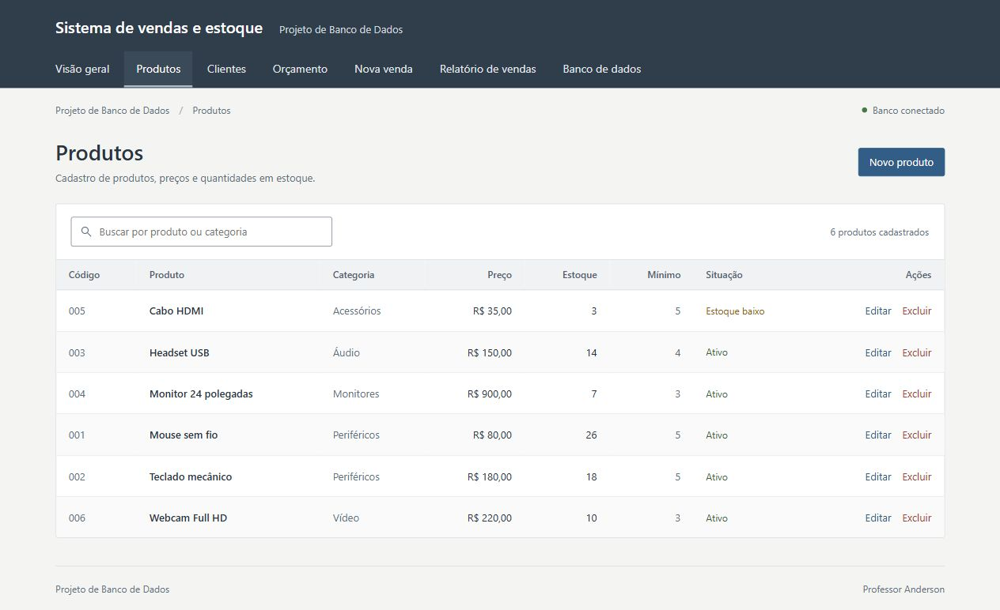

# Referências da interface

A interface foi revisada para apresentar o exemplo de vendas e estoque com cadastros em listas e formulários diretos. As referências orientam a organização das telas e a leitura das informações na demonstração acadêmica.

## Sistemas de gestão consultados

| Referência | O que observar | Aplicação no projeto |
| --- | --- | --- |
| [Bling — módulo de Produtos](https://ajuda.bling.com.br/hc/pt-br/articles/360047475233-Entendendo-o-m%C3%B3dulo-de-Produtos) | Consulta de produtos em lista, com código, preço e estoque. | Colunas próprias para código, preço, estoque atual e mínimo. |
| [Bling — cadastro de produtos](https://ajuda.bling.com.br/hc/pt-br/articles/360036756914-Como-cadastrar-produtos) | Campos de cadastro ligados às informações reais do produto. | Nome, categoria, preço e quantidades com rótulos visíveis. |
| [Olist — pedidos de venda](https://ajuda.olist.com/pt_BR/pedidos/pedidos-de-venda-como-utilizar) | Organização de cliente, produtos e valores dentro do pedido. | Cliente e itens à esquerda, cálculo e confirmação no resumo. |
| [Olist — cadastro de produtos](https://ajuda.olist.com/pt_BR/produtos/como-cadastrar-produtos-conheca-os-5-metodos-disponiveis) | Entrada de dados pelo cadastro e consulta no catálogo. | Botão Novo produto próximo à lista e formulário de edição direto. |
| [ERPNext — alteração de um pedido de venda](https://docs.frappe.io/erpnext/amending-sales-order-after-submit) | Tela de pedido, itens e ações identificadas por sua função. | Ações com nomes explícitos: Adicionar, Remover, Calcular total e Confirmar venda. |

## Técnicas usadas na revisão

1. **Dar prioridade ao conteúdo.** Produtos, quantidades e valores ocupam o espaço principal. A orientação de simplicidade do [Nielsen Norman Group](https://www.nngroup.com/articles/aesthetic-minimalist-design/) serviu de referência.
2. **Usar tabelas para consulta.** Cabeçalhos claros, linhas discretas e valores numéricos alinhados à direita ajudam a comparar registros. Referências: [GOV.UK — tabelas](https://design-system.service.gov.uk/components/table/) e [Nielsen Norman Group — tabelas de dados](https://www.nngroup.com/articles/data-tables/).
3. **Nomear as ações.** Editar e Excluir aparecem por escrito. A ação principal usa azul; as ações secundárias têm menos destaque. Referência: [GOV.UK — botões](https://design-system.service.gov.uk/components/button/).
4. **Manter os rótulos junto aos campos.** Os formulários não dependem de texto dentro do campo para explicar o que preencher. Quantidade e desconto usam espaços menores que nome e produto. Referência: [GOV.UK — campos de texto](https://design-system.service.gov.uk/components/text-input/).
5. **Reduzir a variedade visual.** Uma fonte do sistema, bordas simples, cantos discretos e poucas cores. A cor de alerta acompanha o texto Estoque baixo e a quantidade disponível.
6. **Escrever para a tarefa.** Textos curtos explicam o que a tela faz e quando o estoque muda. Cada aviso tem relação com uma ação ou um dado mostrado.
7. **Adaptar a estrutura à largura disponível.** O menu permite rolagem horizontal em telas pequenas; formulários e resumo passam para uma coluna; tabelas permanecem consultáveis com rolagem dentro da própria lista.

## Conferência na aplicação

- Busca por produto, abertura da edição e abertura do cadastro de cliente.
- Orçamento com 2 mouses de R$ 80 e 1 teclado de R$ 180: subtotal de R$ 340 e total de R$ 306 após 10% de desconto. Transferência dos itens para Nova venda.
- Filtro do relatório para um período sem vendas, limpeza do filtro e consulta dos detalhes de uma venda.
- Seleção de View, Function e Procedure, com exibição do código e da chamada real do orçamento.
- Layout em janela de 390 px: formulários em uma coluna e rolagem da tabela dentro da lista, sem aumentar a largura da página.
- Conferência do console do navegador, sem erros de JavaScript registrados durante essas verificações.

## Ferramentas úteis

| Ferramenta | Para que ajuda | Uso nesta revisão |
| --- | --- | --- |
| Navegador e inspeção da página | Conferir a aplicação real, abrir formulários e simular um orçamento. | Verificação do visual e dos fluxos após alterar HTML, CSS e JavaScript. |
| [WebAIM Contrast Checker](https://webaim.org/resources/contrastchecker/) | Comparar a cor do texto com o fundo. | Verificação do azul principal, do texto secundário e das bordas dos campos. |
| [Chrome DevTools — modo de dispositivo](https://developer.chrome.com/docs/devtools/device-mode) | Simular larguras menores e investigar problemas de layout. | Referência para conferir futuras alterações. |
| [Penpot](https://help.penpot.app/user-guide/) | Rascunhar telas, organizar componentes e montar protótipos antes de programar. | Alternativa para futuras mudanças. Não foi necessário criar um protótipo separado nesta revisão. |

No WebAIM, o azul `#315d86` com branco apresentou contraste **6,9:1**; o texto secundário `#62707c` sobre o fundo `#f4f4f2`, **5,08:1**. As bordas dos campos `#7f8a95` com branco apresentaram **3,19:1**. São verificações desses pares de cores, sem representar uma auditoria completa de acessibilidade.

Para futuras alterações, use dados reais do catálogo durante a revisão, abra o formulário correspondente e tente concluir uma tarefa inteira. Uma tela pode parecer organizada e ainda dificultar localizar um produto, entender um valor ou confirmar uma venda.

As fontes foram consultadas em 04/10/2026. A imagem da aplicação no README foi atualizada após a revisão.
